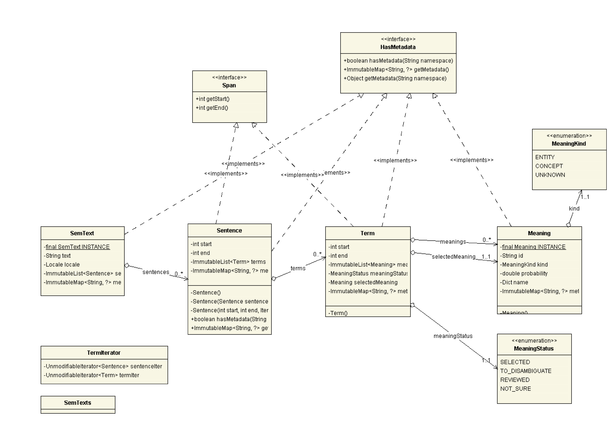
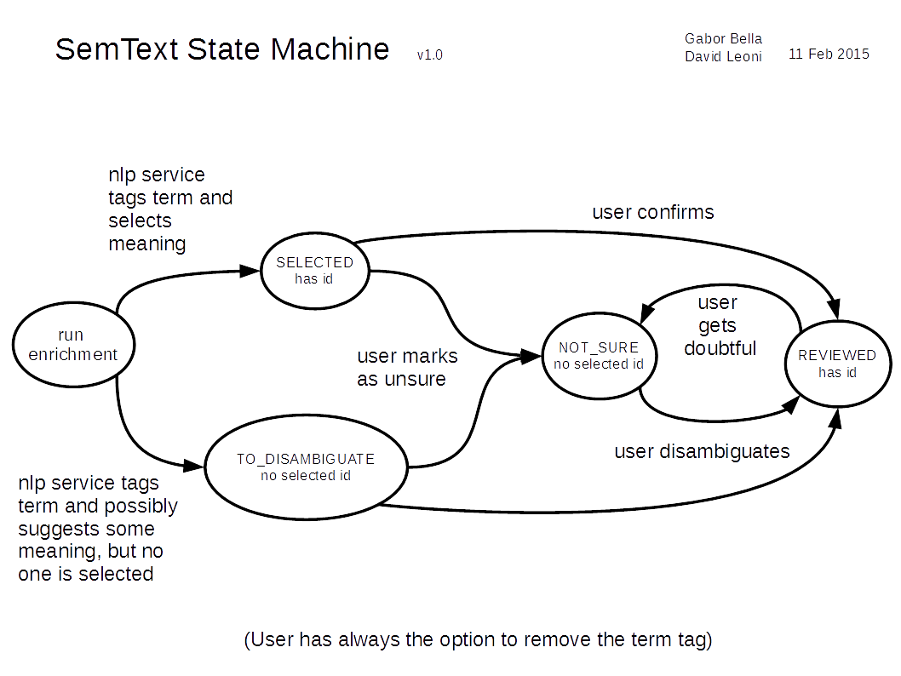

<p class="jedoc-to-strip">
WARNING: WORK IN PROGRESS - THIS IS ONLY A TEMPLATE FOR THE DOCUMENTATION. <br/>
RELEASE DOCS ARE ON THE <a href="http://opendatatrentino.github.io/semtext/" target="_blank">PROJECT WEBSITE</a>
</p>


SemText is a lightweight model for semantically annotated text, designed for reliable exchange among applications rather than for efficiency.

  * provides a simple hierarchy of sentences and terms
  * has immutable data structures
  * allows attaching metadata to spans

The purpose of this release is to provide a first model sufficiently stable to be reusable in different projects.

### UML diagram

A `SemText` object contains a list of `Sentence`, which in turn can contain a list of `Term`. Each `Term` has a `MeaningStatus`, and possibly a selected meaning and a list of alternative meanings suggested for disambiguation.  Both sentences and terms are spans, and actual text is only stored in root `SemText` object. `Span` offsets are always absolute and calculated with respects to it. Spans can't overlap. All of semantic text items (sentences, terms, meaning, semtext itself) can hold metadata.

Utility functions are held in `SemTexts` class and to iterate through semtext terms a `TermsView` and a `TermIterator` are provided.

<p align="center">

</p>

### Meaning state machine

SemText data model supports a four state simple interaction cycle with the user where some nlp service enriches the text with tags and then a human user validates the tags.


<p align="center">

</p>


### Usage

#### Maven dependency

SemText is available on Maven Central. To use it, put this in the dependencies section of your _pom.xml_: 


```
<dependency>
  <groupId>eu.trentorise.opendata.semtext</groupId>
  <artifactId>semtext</artifactId>
  <version>#{version}</version>
</dependency>
```

In case updates are available, version numbers follows [semantic versioning](http://semver.org/) rules.

#### Examples

Objects have no public constructor. To make them use factory methods starting with `of`:

```
	SemText.of(Locale.ITALIAN, "ciao");
```

Let's construct a SemText of one sentence and one term with SELECTED meaning.

```
        String text = "Welcome to Garda lake.";

        Meaning meaning = Meaning.of("http://someknowledgebase.org/entities/garda-lake",
        							 MeaningKind.ENTITY,
                                     0.7);
```

We indicate the span where 'Garda lake' occurs (terms can span many words):

```
	Term term = Term.of(11, 21, MeaningStatus.SELECTED, meaning);
```

Language can be set only for the whole `SemText`:

```
SemText semText = SemText.of(
                Locale.ENGLISH,
                text,
                Sentence.of(0, 26, term)); // sentence spans the whole text
```

Only `SemText` actually contains the text:

```
	assert "Garda lake".equals(semText.getText(term));
```

`SemTexts` class contains utilities, like converters and checkers:

```
    ImmutableList<SemText> semtexts = SemTexts.dictToSemTexts(Dict.of(Locale.ITALIAN, "Ciao"));
    try {
        SemTexts.checkScore(1.7, "Invalid score!");
    } catch(IllegalArgumentException ex){

    }
```

Other examples usages can be found [in the tests](../src/test/java/eu/trentorise/opendata/semtext/test/SemTextTest.java
)
