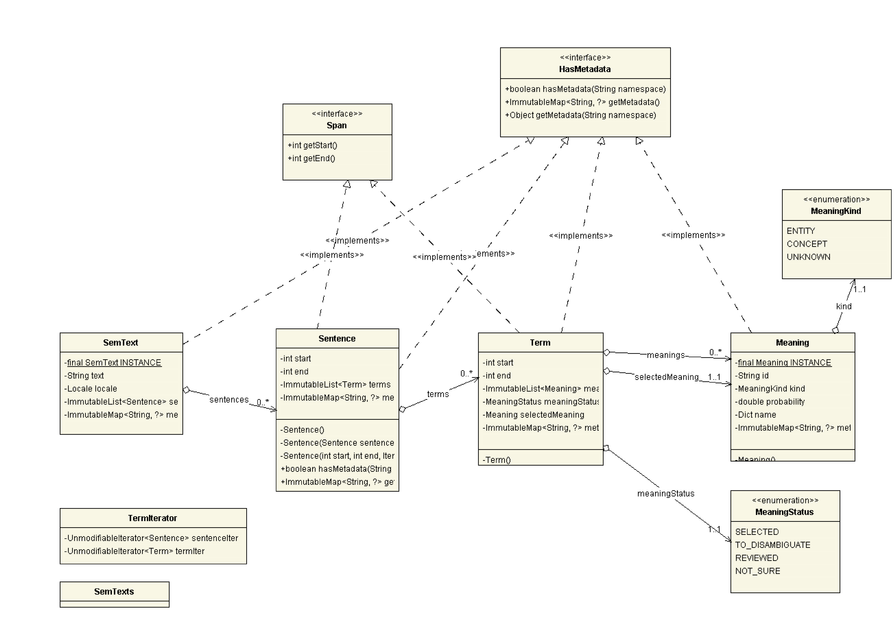
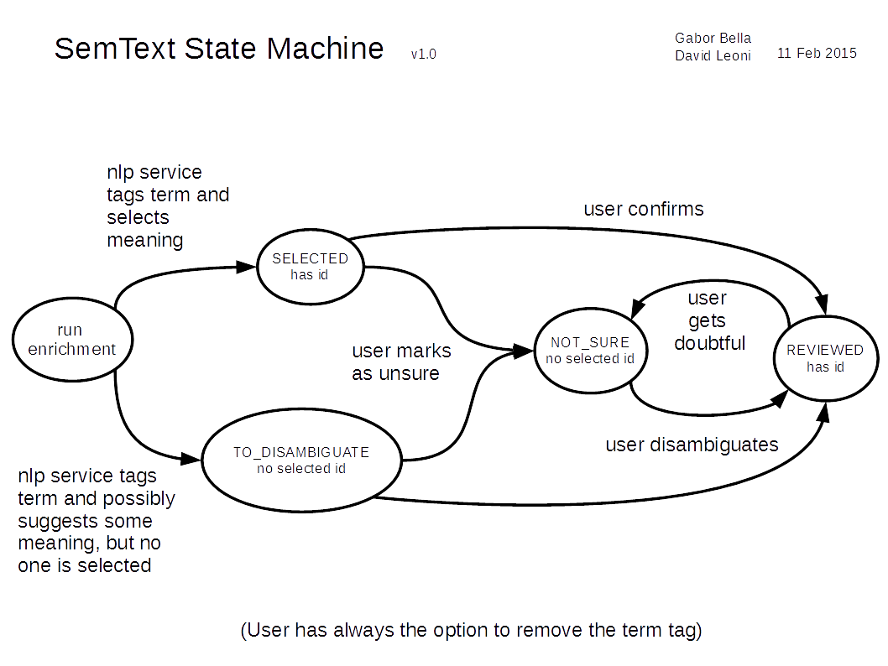

### Introduction

SemText is a lightweight model for semantically annotated text, designed for reliable exchange among applications rather than for efficiency. For [[Contributing]], see relative page. 

### UML diagram

<p align="center">

</p>

### Meaning state machine

<p align="center">

</p>


### Usage

Crude examples usages can be found [in the tests](../../src/test/java/eu/trentorise/opendata/semantics/nlp/test/model/SemTextTest.java
)

```
todo put better examples
```